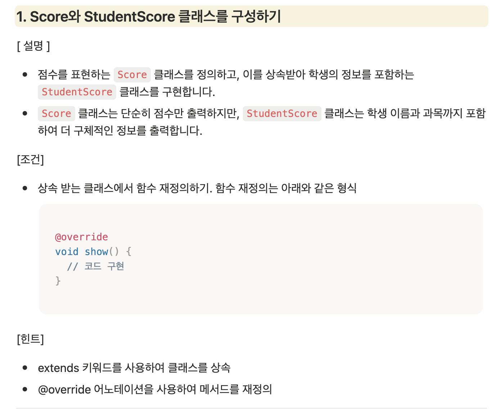

#과제

##클래스와 상속받는 클래스 함수 재정의하기

** extends로 상속받고 @override로 재정의 표현하기**

##파일로부터 데이터 읽어오기 기능

**저장된 파일에 데이터 가져와서 사용하기**

##사용자로부터 입력 받아 학생 점수 확인 기능

**dart run 기능 이용해 학생이름으로 점수 확인하기**

##프로그램 종료 후, 결과를 파일에 저장하는 기능

**지금까지 실행한 기능 후 결과를 result파일에 저장하기**

##코드 실행 예시

**터미널로 명령줄 인터페이스 사용해 구현하기**
